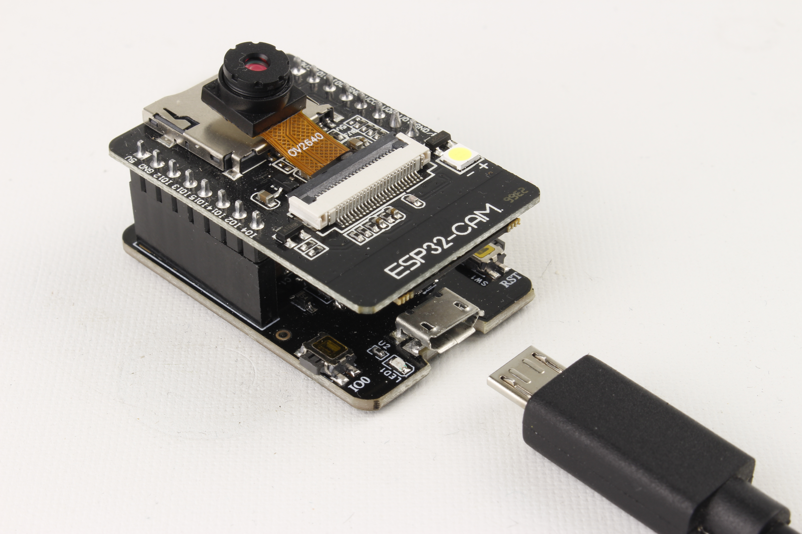

Maker Media GmbH

***

# Zeitraffer-Kamera

## Ein Make-Projekt mit der ESP32-CAM

Um erste Erfahrungen mit der Programmierung der Kamera und des SD-Karten-Moduls zu sammeln, ist eine Zeitraffer-Kamera ein optimales Projekt. Sie benötigt keine zusätzliche Hardware und nutzt fast alle Funktionen der entsprechenden ESP32-APIs.

Hier gibt es den Code zum Projekt im Ordner _src_.

Der vollständige Artikel zum Projekt steht im **[Make-Special ESP32-CAM 2023](https://shop.heise.de/make-esp32-cam-special-2023-board-ov2640?wt_mc=intern.shop.shop.make_esp32cam.t5.textlink.textlink)** ab Seite 14.
